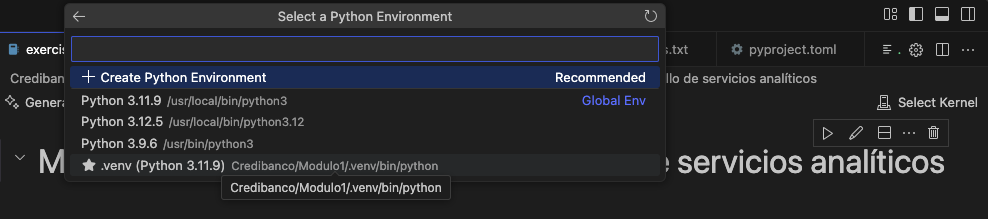

# Modulo 1: Fundamentos para el desarrollo de servicios analíticos automatizados

En la presentación del modulo 1 se abordaron conceptos como APIs e implementación a través del servicio FASTAPI, Github y Docker.

El objetivo del presente repositorio es disponibilizar los ejemplos prácticos para su exploración y ejecución. De igual forma, el objetivo es que las herramientas expuestas sean guía para futuras implementaciones.

## Descripción de contenido

El modulo 1 está compuesto por los siguiente archivos:

- Carpeta "src":
    
    - Contiene las carpetas:

        - notebooks:

            - jupyter notebook "exercise1.ipynb": Contiene un ejemplo de análisis de datos que extrae información de una API, procesa la información para realizar un análisis de redes transacionales y disponibiliza la información en FASTPI a través de un endpoint.

        - scripts

            - Contiene las carpetas:

                - api_inference: Se expone un caso de uso donde se consumen los pesos de un modelo de ML para realizar inferencias a través de FASTAPI.

                - activity: Se brinda archivo ".py" para que se realice actividad práctica con FASTAPI.  

- Archivo "pyproject.toml": Contiene las dependencias necesarias de python para ejecutar los archivos de python o jupyter notebooks. El archivo es compatible con el servicio "UV", el cual permite gestionar ambientes virtuales para proyectos de python. 

- Archivo "uv.lock": El archivo contiene la metadata de las dependencias a las que acceder "UV".

Los dos anteriores archivos se crean en la medida que se utiliza un ambiente virtual de "UV" para gestionar proyectos de python.

## Ejecución

0. Consideraciones

a) Requisitos

Para ejecutar el notebook es necesario tener instalado en el equipo el programa python. De igual forma, el objetivo es que se clone el presente repositorio, por ello, también es necesario descargar el programa git y crear una cuenta en github.
   
python: https://www.python.org/downloads/ (Se recomienda descargar versiones que cuenten con estatus "security")

Importante instalar python con la librería "PIP".

Una vez realizada la instalación, instalar la librería "UV" con el comando:

git: https://git-scm.com/

Si se está utilizando windows, se recomienda descargar gitbash como consola de comandos, utilizar la terminal de visual studio code o cualquier IDE de preferencia.

b) Preparacion ambiente virtual uv:

- Crear un ambiente virtual:

    * Ubicarse en la ruta -> Credibanco/Modulo1/

    * Ejecutar las instrucciones:

        python3 -m venv .venv

        source .venv/bin/activate (Mac) ó python3 .venv/Scripts/activate (Windows)

        uv sync

        En caso que hayan problemas con "UV", seguir los siguiente pasos para utilizar pip:

        uv pip install --requirement requirements.txt

        Una vez se carguen las dependencias, dar click en "select kernel" y seleccionar ".venv"

        Si no se evidencia el kernel, es necesario registrarlo:

        python -m ipykernel install --user --name=.venv --display-name "Python (.venv)"

c) Ejemplo 1: jupyter notebook "exercise1.ipynb":

    Ejecutar celda por celda. El cargue de los datos tarda unos minutos.

d) Ejemplo 2: api_inference:

    Desactivar el ambiente virtual vigente: deactivate

    Crear un nuevo ambiente virtual en la ruta: ./api_inference/app/

    python3 -m venv .venv_api_inference

    uv pip install --requirement requirements.txt o pip install -r requirements.txt

    python3 main.py  

    Con el anterior comando se desplegará el servicio de FASTAPI. El cual se generará en el host:

    http://127.0.0.1:8000/docs (Pegar en el google chrome o firefox)

    Si se ejecuta en paralelo (otra terminal) el archivo request_api.py se realizará un inferencia a la API desplegada.

    python3 request_api.py

e) Actividad:

    La actividad se encuentra en la parte final del jupyter notebook "exercise1.ipynb". El enunciado es el siguiente:

        - En la carpeta activity encontrará un archivo python llamado "data.api.py". Levante el servicio de la api y realice la lectura de datos.

        URL para leer datos: http://127.0.0.1:8080/iris

        Se debe indicar la URL en una variable e implementar request.get(url). Guardar resultado en una variable

        - Al anterior resultado (ejemplo variable response), guardar en una variable "response.json()".

        - La variable guardada previamente, incluirla en un método pd.DataFrame:
            EJ: pd.DataFrame(data)

        - Considere la información obtenida, realice la lectura de datos, procese la información de tal manera que se genere un resumen de los datos (agrupamiento mediante group by - misma lógica que las tablas dinámica) y disponibilizar la información en fastapi para consulta en el puerto 8980.

   

