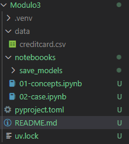

# LangChain Session

Welcome to the LangChain Session

## Getting Started

### Python Environment (IMPORTANT)

This course repo contains everything you need to install an exact duplicate Python environment as used during the course creation. 

#### Installing Python Venvs

The Python packages are managed using the [uv](https://github.com/astral-sh/uv) package manager, and so we must install `uv` as a prerequisite for the course. We do so by following the [installation guide](https://docs.astral.sh/uv/#getting-started). For Mac users, as of 22 Oct 2024 enter the following in your terminal:

```
curl -LsSf https://astral.sh/uv/install.sh | sh
```

Once `uv` is installed and available in your terminal you can navigate to the course root directory and execute:

```
uv python install 3.12.7
uv venv --python 3.12.7
uv sync
```

> ❗️ You may need to restart the terminal if the `uv` command is not recognized by your terminal.

With that we have our chapter venv installed. When working through the code for a specific chapter, always create a new venv to avoid dependency hell.

#### Using Venv in VS Code / Cursor

To use our new venv in VS Code or Cursor we simply execute:

```
cd example-chapter
cursor .  # run via Cursor
code .    # run via VS Code
```

This command will open a new code window, from here you open the relevant files (like Jupyter notebook files), click on the top-right **Select Environment**, click **Python Environments...**, and choose the top `.venv` environment provided.

#### Uninstalling Venvs

Naturally, we might not want to keep all of these venvs clogging up the memory on our system, so after completing the course we recommend removing the venv with:

```
deactivate
rm -rf .venv -r
```

# Folders Structure

The following image presents the recommend structure for the file case.ipynb

